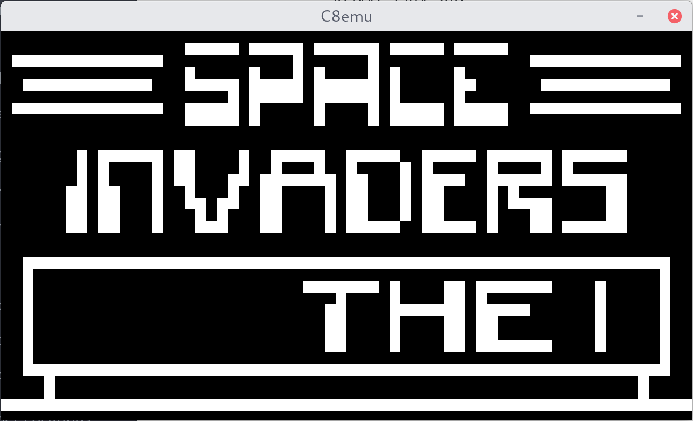
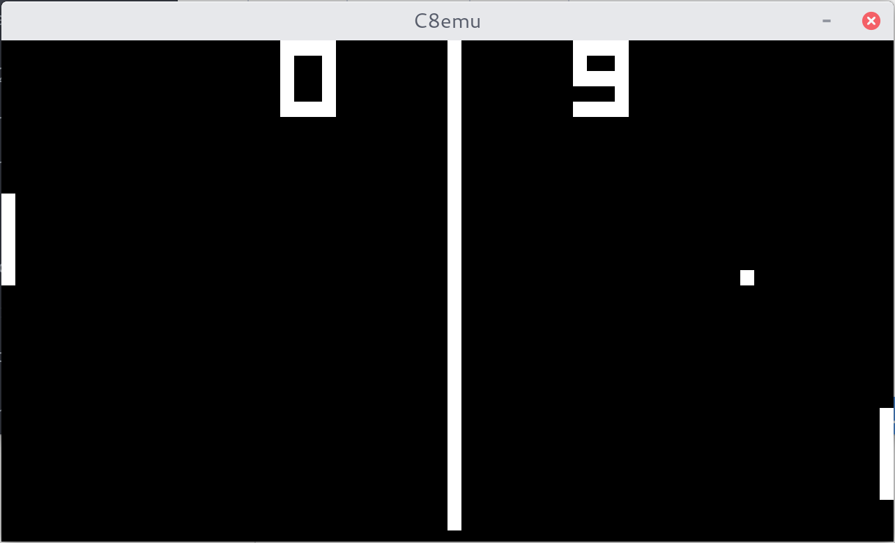

# C8emu

C8emu is just another Chip-8 based emulator that uses C++ and SDL2.





## Building and Running

This project requires *cmake* to build.

To build:

```
$ git clone https://github.com/aymanbagabas/C8emu.git && cd C8emu
$ mkdir build && cd build
$ cmake ..
$ make
```

To run:

```
./C8emu [ROM FILE]
```

Add `-v` to debug.

You can find some ROMs under the `roms` directory.

## References

* [How to write an emulator](http://www.multigesture.net/articles/how-to-write-an-emulator-chip-8-interpreter/)
* [Cowgod's Chip-8 Technical Reference v1.0](http://devernay.free.fr/hacks/chip8/C8TECH10.HTM)
* [CHIP-8](https://en.wikipedia.org/wiki/CHIP-8)
* [Lazy Foo' SDL2 Tutorial](http://lazyfoo.net/tutorials/SDL/index.php)
